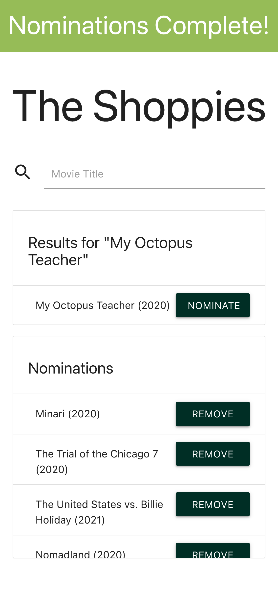
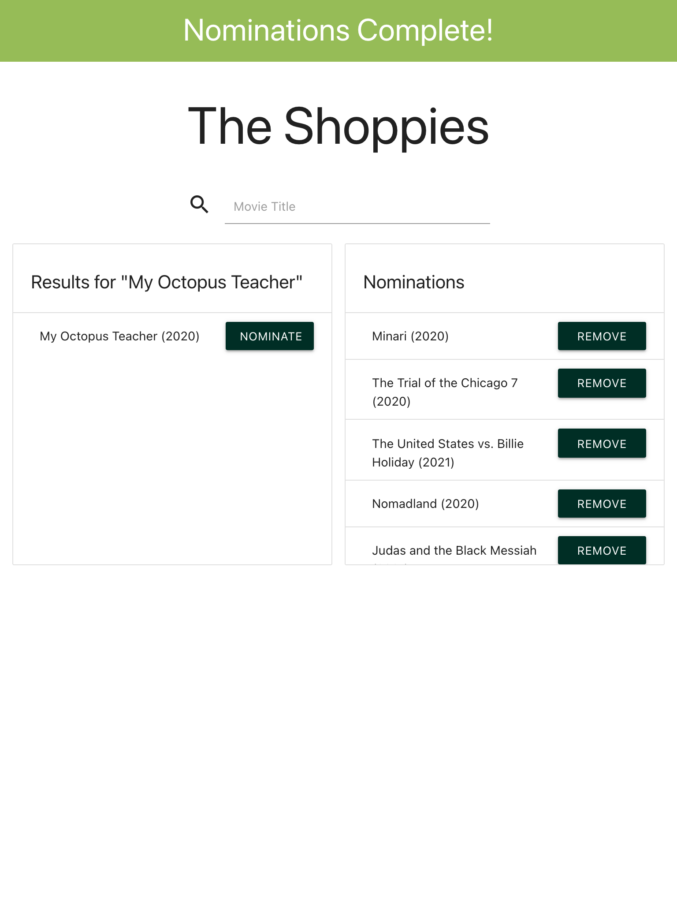
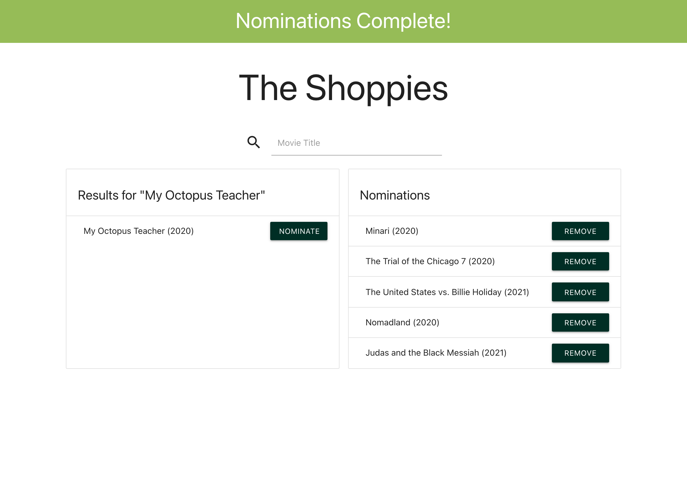

# theShoppies

  [Deployed App](https://segh-shoppies.netlify.app/)
  
  ## Description
  A single page React application that allows a user to search for movies by their title using the OMDB API and save movies they wish to nominate. React-Materialize is used for styled components, Materialize-CSS as css framework, and Material-Design-Icons for icons. Dexie is used as a wrapper for indexedDB and Dexie-React-Hooks to live query the database.

  ## Table of Contents
  * [Usage](#usage)
  * [Questions](#questions)

  ## Usage
  
  

  * After the user enters a movie title in the searchbar, results are displayed below
  * If there is an error with the search (Too many results, Movie not found), messages will display in the results header
  * The user can choose to nominate a movie by clicking on its corresponding "Nominate" button
  * When nominated, the movie will display in the Nominations list
  * When the maximum of 5 nominations have been reached, a banner will display declaring "Nominations Complete!" and the user will not be able to select more movies
  * If a user tries to nominate more movies once the maximum is reached, a message displays in the banner for 5 seconds, notifying the user they've reached the limit
  * Users can remove nominated movies from their list by clicking the corresponding "Remove" button
  * Nominations are saved to the browser in IndexedDB, allowing the user to see their current nominations after leaving or refreshing the page
  
  App is responsive and can be used on mobile, tablet, or desktop devices:

    
  
  

  ## Questions
  Hi, I'm [SEGH](https://github.com/SEGH), feel free to contact me with any questions through [email](mailto:SEG.Holland@gmail.com)